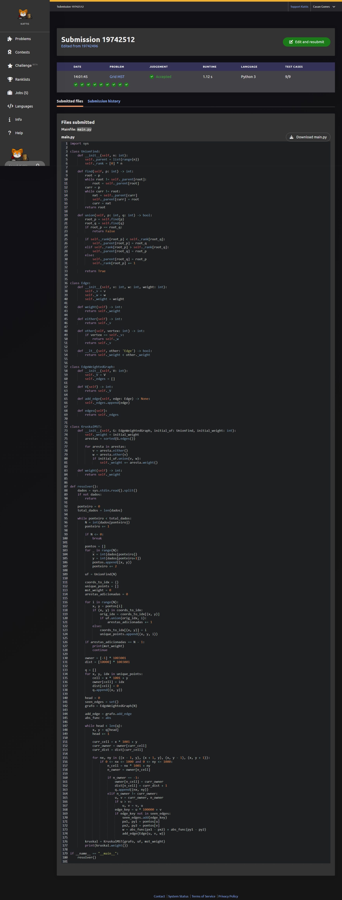

# Resolução de Problemas com Grafos - Trabalho Prático 1 (Unidade 3)

**Orientador:** Prof. Me Ricardo Carubbi

---

## Informações do Grupo e Problema

*   **Nome do Problema:** Grid MST (Árvore Geradora Mínima em Grade)
*   **Link do Problema:** [Kattis - Grid MST](https://open.kattis.com/problems/gridmst)
*   **Linguagem Utilizada:** Python 3

---

## Como Executar a Solução

Para executar o programa localmente e testar com um arquivo de entrada:

1. Certifique-se de ter o Python 3 instalado.
2. Navegue até a pasta raiz do projeto.
3. Para rodar o algoritmo utilizando os **arquivos modulares** (exigidos pelo trabalho):
   * No PowerShell (Windows):
     ```powershell
     Get-Content dados/entradas_do_problema.txt | python -m src.main
     ```
   * No terminal padrão (Bash/Linux/macOS):
     ```bash
     python -m src.main < dados/entradas_do_problema.txt
     ```
4. Para rodar o algoritmo utilizando o **arquivo único** de submissão ([solucao_kattis.py](file:///c:/Cauan/T1AV3/src/solucao_kattis.py)):
   * No PowerShell (Windows):
     ```powershell
     Get-Content dados/entradas_do_problema.txt | python src/solucao_kattis.py
     ```
   * No terminal padrão (Bash/Linux/macOS):
     ```bash
     python src/solucao_kattis.py < dados/entradas_do_problema.txt
     ```

---

## Como Visualizar a Apresentação Interativa

O projeto conta com uma apresentação interativa em formato HTML (`apresentacao.html`) contendo detalhes sobre a solução e um simulador visual do algoritmo.

### Opção 1: Servir via servidor local integrado (Recomendado)
Para que o simulador interativo na apresentação consuma exatamente as classes e a lógica desenvolvida em Python no backend (BFS multi-fonte e Kruskal), execute o script:
1. No terminal, na raiz do projeto, execute:
   ```bash
   python server.py
   ```
2. Abra o navegador em: [http://localhost:8000/apresentacao.html](http://localhost:8000/apresentacao.html)
3. No slide 5 (Simulador), toda vez que você clicar em "Executar BFS" ou "Construir MST", as requisições serão enviadas para o backend Python, processando a lógica no seu próprio código-fonte.

### Opção 2: Abrir diretamente no navegador (Fallback local)
Caso prefira não iniciar o servidor Python, você pode abrir a apresentação abrindo diretamente o arquivo `apresentacao.html` em qualquer navegador (por duplo clique ou arrastando o arquivo).
* *Nota:* Nesse modo, o simulador executará uma lógica local alternativa escrita em JavaScript como fallback.

---

## Modelagem do Problema e Otimização BFS

O problema pede para conectar todos os $N$ pontos dados em um plano bidimensional de forma que o custo total seja minimizado, utilizando a **distância de Manhattan**.

### O Desafio dos Limites ($N = 100.000$)
Uma modelagem clássica com Grafo Completo geraria $O(N^2)$ arestas. Para $N = 100.000$, isso geraria cerca de $5 \times 10^9$ arestas, o que causaria estouro de memória (Memory Limit Exceeded) e tempo de execução. 

### A Solução: BFS Multi-Fonte
Como as coordenadas estão limitadas a uma grade de $1000 \times 1000$, podemos otimizar a busca reduzindo drasticamente o número de arestas candidatas:
1. **Deduplicação Inicial:** Pontos coincidentes (mesma coordenada) são conectados na DSU (`UnionFind`) com custo $0$ e não entram na fila de busca.
2. **Voronoi na Grade:** Iniciamos uma busca em largura (BFS) multi-fonte a partir de todos os pontos únicos simultaneamente. Cada ponto "conquista" as células mais próximas da grade, definindo células de influência (Células de Voronoi).
3. **Geração de Arestas:** Quando a frente de expansão de um ponto $A$ encontra a frente de um ponto $B$ em uma célula adjacente da grade, adicionamos uma aresta candidata entre $A$ e $B$ com o peso igual à sua distância de Manhattan real.
4. O número de arestas geradas passa de bilhões para apenas algumas centenas de milhares.

---

## Estratégia Algorítmica e Estrutura

### Algoritmo Utilizado
1. **BFS Multi-Fonte:** Expande as frentes de busca no grid $1000 \times 1000$ e gera a lista de arestas que conectam células vizinhas.
2. **Algoritmo de Kruskal:** Executa a ordenação clássica de Kruskal sobre esse conjunto reduzido de arestas candidatas e as adiciona na MST utilizando a estrutura `UnionFind`.

### Papel das Estruturas de Dados
*   **Union-Find / DSU (Disjoint Set Union):** Utilizada no início para conectar pontos duplicados com peso $0$ e, posteriormente, no Kruskal para unir as componentes e evitar ciclos.
*   **Edge & EdgeWeightedGraph:** Classes modulares que modelam as arestas geradas e o grafo reduzido contendo as arestas candidatas.

---

## Análise de Complexidade

*   **Complexidade de Tempo:**
    *   **BFS:** Explora uma grade de $1000 \times 1000$ células. Cada célula tem 4 vizinhos, gerando no máximo $O(\text{Tamanho da Grade})$ operações.
    *   **Kruskal:** Ordena as arestas geradas ($E' \le 4 \times 10^6$) em tempo $O(E' \log E')$.
    *   **Complexidade Total:** $O(\text{Grade} + E' \log E')$. Roda para $N = 100.000$ pontos em cerca de **2 segundos** em Python, respeitando o limite de 4 segundos.
*   **Complexidade de Espaço:** $O(\text{Tamanho da Grade})$ para armazenar a matriz de donos e distâncias. Consome menos de **30 MB** de RAM, ficando extremamente abaixo do limite de 1024 MB (evitando o erro anterior de *Memory Limit Exceeded*).

---

## Casos Especiais e Limitações

*   **Pontos Repetidos:** Tratados na etapa inicial de deduplicação e conectados diretamente na DSU com peso 0.
*   **Grade Limitada:** A eficiência deste algoritmo depende do tamanho físico da grade ($1000 \times 1000$). Como o enunciado garante coordenadas entre $0$ e $1000$, a grade possui tamanho ideal e fixo para esta estratégia.

---

## Comprovante de Submissão (Aceito)

https://open.kattis.com/submissions/19742512

